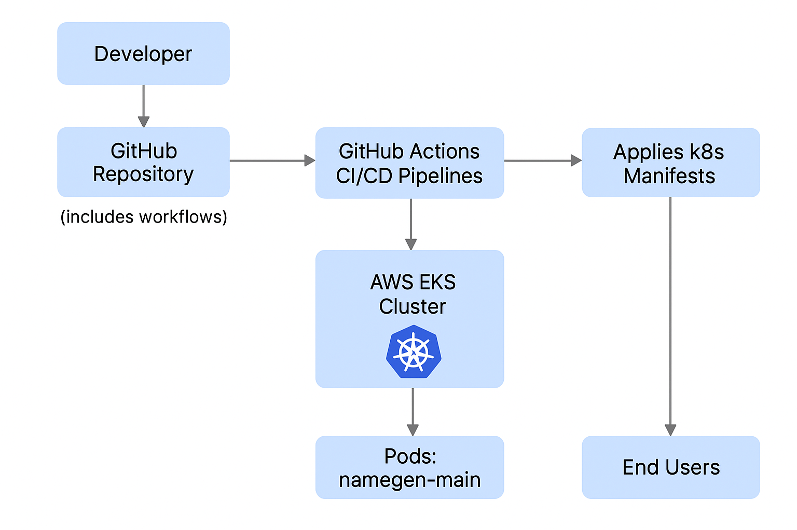
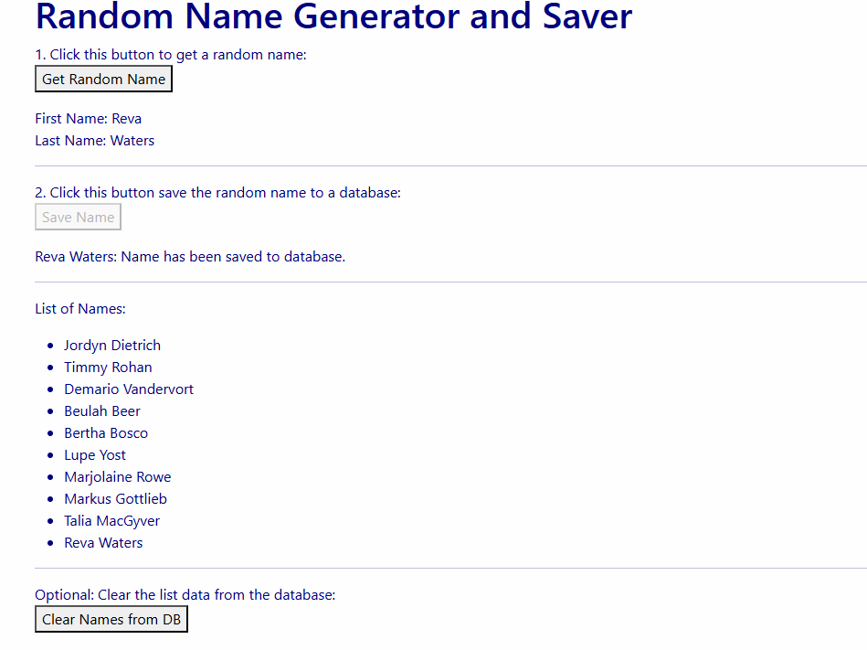
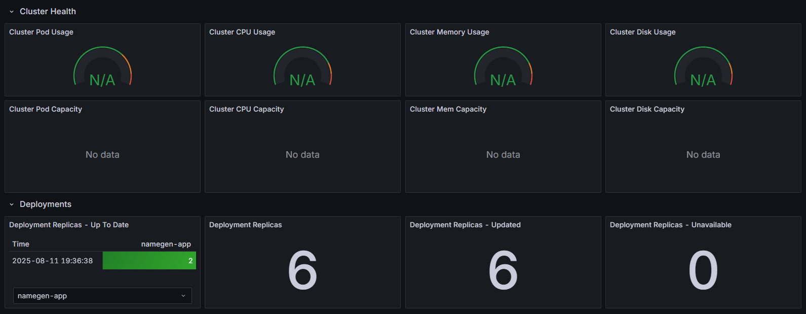
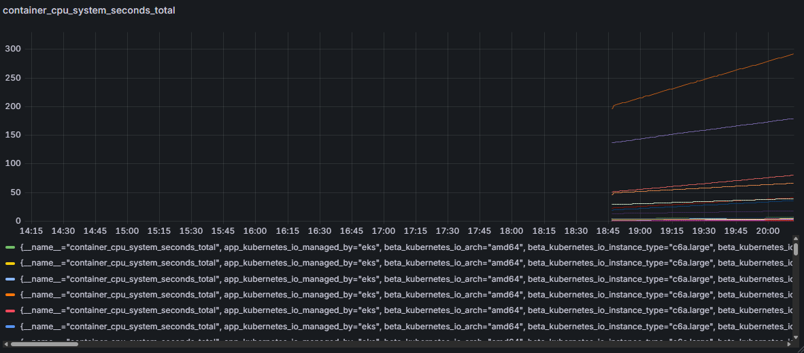

# 🚀 FinalDevOpsProject

## 📌 Overview
**FinalDevOpsProject** is a fully automated **DevOps pipeline** for building, testing, and deploying a containerized application on **AWS EKS**.  
It showcases:
- 🏗 **Infrastructure as Code** (IaC)
- ⚙ **CI/CD Automation** with GitHub Actions
- ☸ **Kubernetes Orchestration** on Amazon EKS

---

## 🛠 Architecture & Components
- 📂 **EKS_Cluster/** – IaC files for creating the EKS cluster.
- 📂 **k8s_manifests/** – Kubernetes YAML manifests (Deployments, Services, StatefulSets, etc.).
- 📂 **namegen-main/** – Application source code.
- 📄 **Dockerfile** – Container image build instructions.
- 📂 **.github/workflows/** – GitHub Actions CI/CD pipelines.

---

## 📋 Prerequisites
Before running the project, ensure you have:
- 🐳 **Docker** installed
- ☁ **AWS CLI** configured with EKS permissions
- 🔧 **kubectl** installed & connected to your EKS cluster
- 🔑 GitHub repository with **Actions enabled**

---

## 💻 Cluster Management Commands

```bash

# 🚀 Create the EKS cluster
eksctl create cluster -f ./EKS_Cluster/cluster.yaml

# 🗑 Delete the EKS cluster when done
eksctl delete cluster -f ./EKS_Cluster/cluster.yaml
```
## 🖼 Architecture & CI/CD Pipeline Diagram
  

## 🌐 Application in Action
  

## 📊 Grafana Monitoring
  
  


