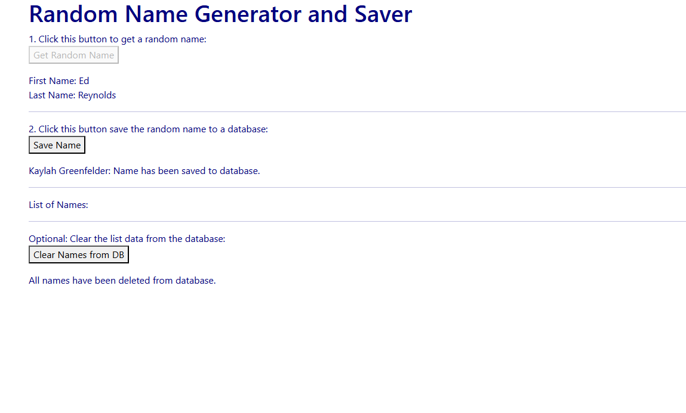

# FinalDevOpsProject

## Overview
FinalDevOpsProject is a complete DevOps pipeline implementation for building, testing, and deploying a containerized application to a Kubernetes cluster (EKS).  
It demonstrates Infrastructure as Code, CI/CD automation, and Kubernetes orchestration using GitHub Actions.

## Architecture & Components
- **EKS_Cluster/** – Infrastructure code for creating an AWS EKS Kubernetes cluster.
- **k8s_manifests/** – Kubernetes YAML manifests (Deployments, Services, ConfigMaps, etc.).
- **namegen-main/** – Application source code.
- **Dockerfile** – Instructions for building the application container image.
- **.github/workflows/** – GitHub Actions CI/CD automation pipelines.

## Prerequisites
Before running the project, you’ll need:
- Docker installed
- AWS CLI configured with EKS permissions
- kubectl installed & configured for your EKS cluster
- GitHub repository access with Actions enabled

## Bash Commands

```bash
# 1. Build the Docker image
docker build -t namegen-app:latest .

# 2. Tag the Docker image for your registry
docker tag namegen-app:latest <your-registry>/namegen-app:latest

# 3. Push the image to your registry (Docker Hub, AWS ECR, etc.)
docker push <your-registry>/namegen-app:latest

# 4. Apply Kubernetes manifests to deploy the app
kubectl apply -f k8s_manifests/

# 5. (Optional) Verify deployment status
kubectl get pods
kubectl get svc
```
| Diagram |   |   |
|---------|-------|-------|
|  |  |  |

|  |   |   |   |
|-------|-------|-------|-------|
|  |   |  |


